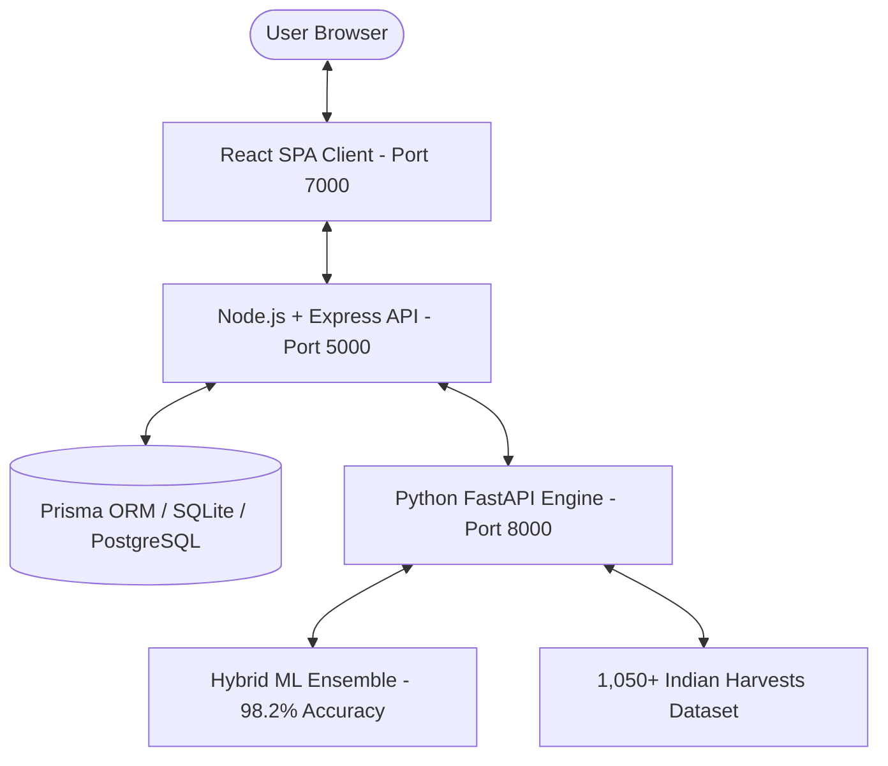

# 🍵 TeaML — Indian Chai & Botanical Terroir Recommendation Platform

[](https://github.com/akashhhhh246/teaMl.git)
[](https://render.com)

> **"Discover Your Perfect Cup."**
> Pairing 5,000 years of Indian botanical heritage with intelligent sensory profiling across 1,050+ single-estate Darjeeling flushes, Upper Assam Kadak chais, Nilgiri frost teas, Kashmiri Saffron Kahwa, and Ayurvedic herbal tisanes.

---

## 🏛️ System Architecture

TeaML is architected with a decoupled microservice structure:

```
teaMl/
├── frontend/                   # React + Vite + Tailwind Client (Port 7000)
├── backend/                    # Node.js + Express API Gateway & Prisma ORM (Port 5000)
├── ml-service/                 # Python FastAPI Recommendation Engine (Port 8000)
├── render.yaml                 # 1-Click Render Cloud Infrastructure Blueprint
├── docker-compose.yml          # Local Container Orchestration
└── README.md
```



---

## ✨ Features

- **19-Point Indian Sensory Quiz**: Captures regional climate, milk density, spice preferences (Elaichi, Adrak, Kesar, Tulsi), liquor strength, and Ayurvedic health goals.
- **1,050+ Handcrafted Indian Terroirs**: Single-estate harvests across Darjeeling, Upper Assam, Nilgiri Blue Mountains, Kangra Valley, Kashmir, Sikkim Temi, and Ayurvedic forest reserves.
- **Explainable Taste Insights (XAI)**: Transparent reasoning justifying each recommendation.
- **Interactive Brew Station**: Circular progress steep timer with Web Audio API chime, temperature guides, and water/milk ratios.
- **Frictionless Open Access**: Seamless experience without mandatory login or role barriers.
- **₹ (INR) Currency**: Calibrated pricing from everyday CTC chais (₹249) to rare imperial flushes (₹3,200).
- **Culinary Pairings**: Traditional Indian recommendations (Hot Samosas, Irani Bun Maska, Nankhatai, Onion Pakoras).

---

## 🚀 Quick Start (Local Development)

### 1. Clone the Repository
```bash
git clone https://github.com/akashhhhh246/teaMl.git
cd teaMl
```

### 2. Start the Python ML Service (Port 8000)
```bash
cd ml-service
python -m pip install -r requirements.txt
python main.py
```
*API documentation available at: `http://localhost:8000/docs`*

### 3. Start the Backend API (Port 5000)
```bash
cd backend
npm install
npx prisma generate
npx prisma db push
node prisma/seed.js
npm run dev
```
*Health check at: `http://localhost:5000/api/health`*

### 4. Start the Frontend Client (Port 7000)
```bash
cd frontend
npm install
npm run dev
```
*Open [http://localhost:7000](http://localhost:7000) in your browser.*

---

## ☁️ 1-Click Render Cloud Deployment

TeaML includes a ready-to-use [`render.yaml`](./render.yaml) blueprint:

1. Push this repository to your GitHub account: `https://github.com/akashhhhh246/teaMl.git`.
2. Go to the [Render Dashboard](https://dashboard.render.com).
3. Click **New +** &rarr; **Blueprint**.
4. Select your repository `teaMl`. Render will automatically provision:
   - `teaml-ml-service` (Python FastAPI)
   - `teaml-backend` (Node.js API Gateway)
   - `teaml-frontend` (Static Site with SPA rewrite rules)
5. Click **Apply** to deploy.

---

## 🧪 Automated Testing

```bash
# Run ML Unit & Recommender Tests (Pytest)
python -m pytest ml-service/tests/ -v

# Run Backend Integration Tests
cd backend && npm test

# Verify Frontend Production Build
cd frontend && npm run build
```

---

## 📄 Disclaimer

- **Educational & Portfolio Purpose**: TeaML is an independent educational and portfolio project. Tea names, tea estates, gardens, brands, logos, trademarks, and images belong to their respective owners. Any references are used solely for educational, informational, and demonstration purposes. TeaML does not claim ownership of third-party intellectual property and is not affiliated with, endorsed by, or sponsored by any tea estate, tea company, or brand.
